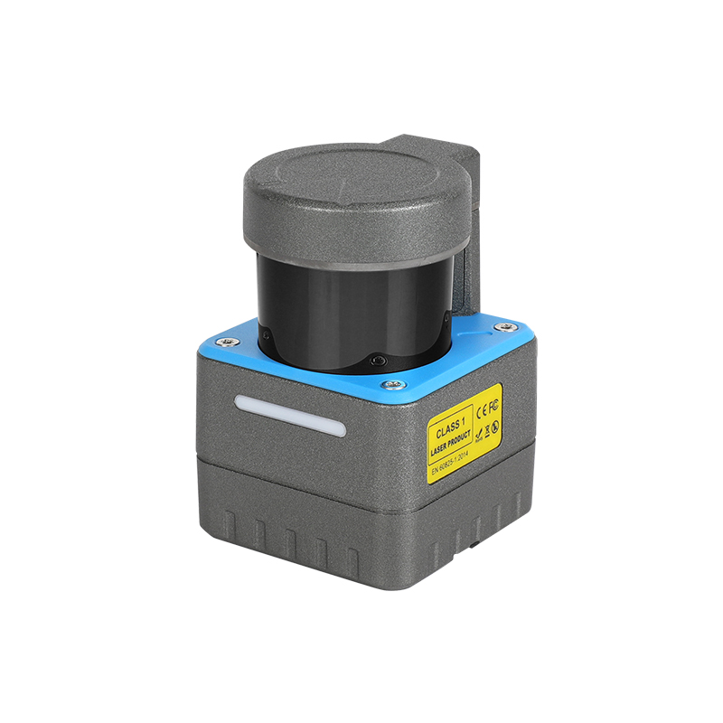
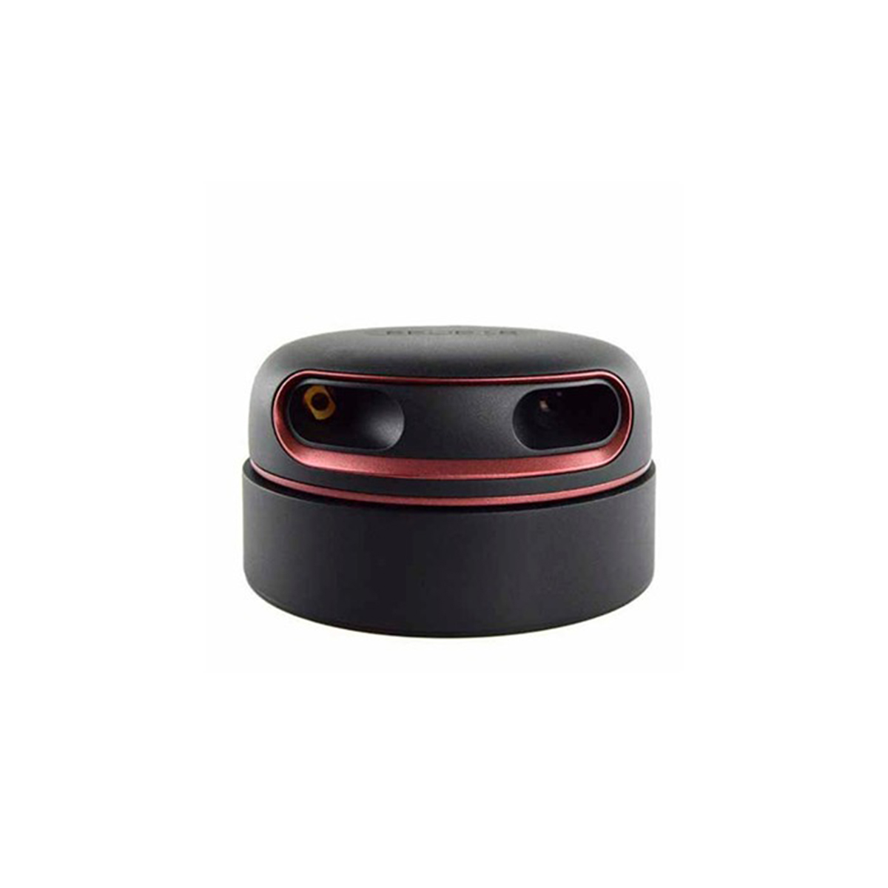

# Components Table For ROS foxy
Image | Link
--- | ---
 | [cogniteam-text-detection](components/cogniteam-text-detection)
 | [ros2-generic-webcam](components/ros2-generic-webcam)
 | [leg-detector](components/leg-detector)
 | [nav2-slam-navigation](components/nav2-slam-navigation)
 | [ros2-olei-3d-lidar-driver](components/ros2-olei-3d-lidar-driver)
 | [ros2-olei-2d-lidar-driver](components/ros2-olei-2d-lidar-driver)
 | [Lakibeam1-ROS2](components/Lakibeam1-ROS2)
 | [ros2-tutorials-talker](components/ros2-tutorials-talker)
 | [ros2-gateway](components/ros2-gateway)
 | [rover-driver](components/rover-driver)
 | [ros2-slamtec-rplidar-a2](components/ros2-slamtec-rplidar-a2)
 | [ros2-slamtec-rplidar-driver-s2](components/ros2-slamtec-rplidar-driver-s2)
 | [tracer-mobile-driver](components/tracer-mobile-driver)
 | [tracer-mobile-driver-mini](components/tracer-mobile-driver-mini)
# Contribution
 If you wish to contribute by adding a new component to our library as part of our ongoing competition, please follow the instructions below:

 ## Prerequisites

Before you begin, ensure you have met the following requirements:

- You have a [GitHub](https://github.com) account.
- You have installed [Git](https://git-scm.com/).
- You have installed [Docker](https://www.docker.com/get-started).

## Forking and Cloning the Repository

1. **Fork the Repository**: Click on the 'Fork' button on the upper right-hand side of the page. A copy of the repository will be created on your personal GitHub account.
2. **Clone the Repository**: Clone the forked repository to your local machine by running:
   ```bash
   git clone https://github.com/cognimbus/Nimbus.Library.Components.ROS.git
   ```

## Adding a New Component

### 1. **Prepare Your Component Structure**
   - `comp_name`: Directory for your component
      - `docker`: Contains code and the Docker file
      - `nimbus`: Contains the Nimbus component JSON file and image with the name nimbusc (nimbusc.json, nimbusc.jpg, etc)

### 2. **Create and Test Your Dockerfile**
   - Navigate to the cloned repository on your local machine.
   - Create a new Dockerfile with the required configurations for the ROS/ROS2 application you wish to containerize.
   - Test your Dockerfile locally with:
     ```bash
     docker build -t ros_app:<tag> .
     docker run --rm -it ros_app:<tag>
     ```

### 3. **Place Your Files in the Directory Structure**
   - Place the Dockerfile and code into the appropriate directory structure within `comp_name/docker`.

### 4. **Commit Your Changes**
   - After testing, commit your changes:
     ```bash
     git add .
     git commit -m "Your detailed commit message"
     ```

## Submitting a Merge Request

1. **Push Your Changes**: Push to your forked repository:
   ```bash
   git push origin master
   ```
2. **Create a Pull Request**: Navigate to your forked repository's GitHub page, click 'Pull request', and write a detailed comment.
3. **Submit**: Click 'Submit pull request'.

## Support and Contact

If you have questions or encounter issues, open an issue in the repository, and one of our maintainers will get back to you as soon as possible. Thank you for your contribution!

---

- [Nimbus Library Components for ROS](https://github.com/cognimbus/Nimbus.Library.Components.ROS)
- [Nimbus Library Components for ROS2](https://github.com/cognimbus/Nimbus.Library.Components.ROS2)