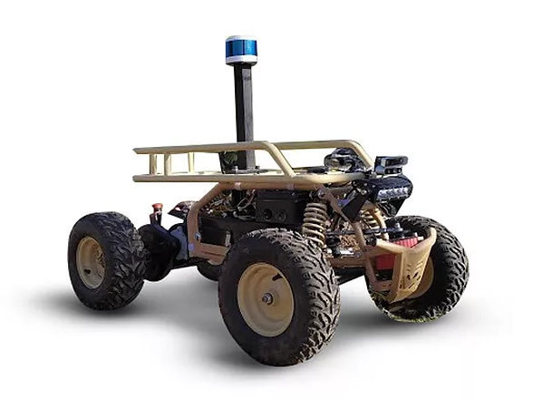

# Lynx-Gps-Localization


* Dockerhub image https://hub.docker.com/r/cognimbus/lynx
* Supported architectures <b>arm64/amd64</b>
* ROS version <b>eloquent-ros-base-bionic
</b>

# Short description
* Cogniteam lynx-gps-localization
git: https://github.com/cognimbus/nimbus.library/tree/master/Library/Components/lynx
License: BSD

# Example usage
```
docker run -it --network=host cognimbus/lynx roslaunch lynx_launch gps_localization.launch tf_prefix:= --screen
```

# Subscribers
ROS topic | type
--- | ---
/sensors/gps/fix | sensor_msgs/NavSatFix
/odom | nav_msgs/Odometry


# Publishers
ROS topic | type
--- | ---
/odom_filtered | nav_msgs/Odometry
/events/localization/datum | sensor_msgs/NavSatFix
/gps_local | geometry_msgs/PointStamped


# Required tf
odom--->base_link


# Provided tf
This node does not provide tf


# Lynx-Navigation



* Dockerhub image https://hub.docker.com/r/cognimbus/lynx
* Supported architectures <b>arm64/amd64</b>
* ROS version <b>eloquent-ros-base-bionic
</b>

# Short description
* Cogniteam lynx navigation
git: https://github.com/cognimbus/nimbus.library/tree/master/Library/Components/lynx
License: BSD

# Example usage
```
docker run -it --network=host cognimbus/lynx roslaunch lynx_launch navigation.launch tf_prefix:= rate:=30 steer_range:=25 steer_trajectories:=51 speed:=1 speed_obstacle:=0.7 goal_tolerance:=2 steer_scale:=1 lidar_3d_min_obstacle_height:=0.2 lidar_3d_max_obstacle_height:=1.5 --screen
```

# Subscribers
ROS topic | type
--- | ---
/commands/navigation/goal | geometry_msgs/PoseStamped
/commands/mission/stop | std_msgs/Empty
/lslidar_point_cloud | sensor_msgs/PointCloud2


# Publishers
ROS topic | type
--- | ---
/ackermann_cmd | ackermann_msgs/AckermannDriveStamped
/events/mission/state | std_msgs/Bool
/events/navigation/state | std_msgs/Bool
/costmap_node/costmap/costmap | nav_msgs/OccupancyGrid
/navigation_path | visualization_msgs/MarkerArray


# Required tf
odom--->base_link


# Provided tf
This node does not provide tf


# Ros2-Lynx-Driver


* Dockerhub image https://hub.docker.com/r/cognimbus/lynx
* Supported architectures <b>arm64/amd64</b>
* ROS version <b>eloquent-ros-base-bionic
</b>

# Short description
* Cogniteam lynx driver
git: https://github.com/cognimbus/nimbus.library/tree/master/Library/Components/lynx
License: BSD

# Example usage
```
docker run -it --network=host cognimbus/lynx roslaunch lynx_driver lynx_driver.launch drive_steering_zero_pwm:=1500 drive_tick_to_m:=0.004508 pid_rate:=50 pid_kp:=2 pid_ki:=0 pid_kd:=0.1 pid_process_smooth_factor:=0 pid_control_smooth_factor:=0.8 --screen
```

# Subscribers
ROS topic | type
--- | ---
/imu | sensor_msgs/Imu
/ackermann_cmd | ackermann_msgs/AckermannDriveStamped
/twist_cmd | geometry_msgs/Twist


# Publishers
ROS topic | type
--- | ---
/odom | nav_msgs/Odometry
/events/drive/pid | geometry_msgs/Vector3


# Required tf
This node does not require tf


# Provided tf
This node does not provide tf


