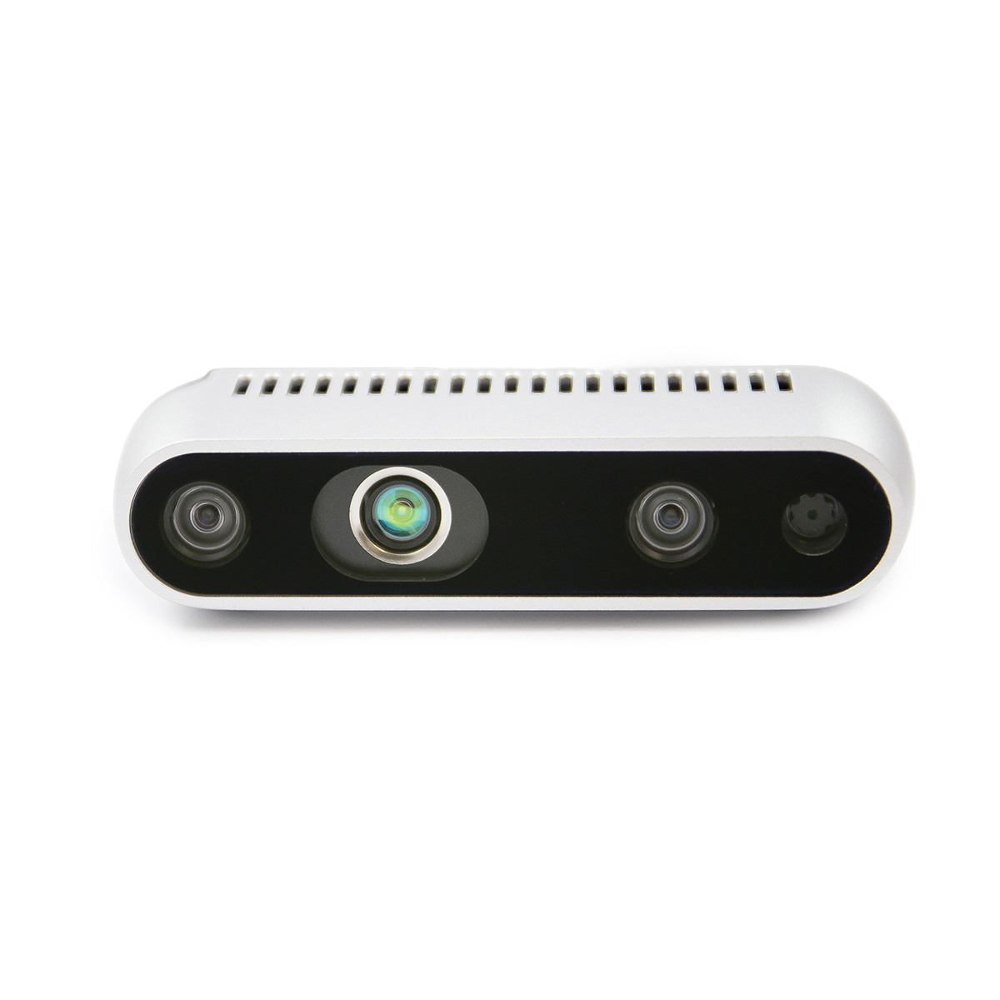

# Ros2-Realsense-D435



* Dockerhub image https://hub.docker.com/r/cognimbus/ros2-realsense-camera
* Supported architectures <b>arm64/amd64</b>
* ROS version <b>galactic
</b>

# Short description
* Intel Realsense D435 ROS2 driver
License: Apache 2.0

# Example usage
```
docker run -it --network=host --privileged cognimbus/ros2-realsense-camera ros2 launch realsense2_camera rs_launch.py camera_name:=camera serial_no:='' unite_imu_method:=0 enable_depth:=true enable_color:=true enable_infra1:=false enable_infra2:=false enable_fisheye1:=false enable_fisheye2:=false enable_gyro:=false enable_accel:=false gyro_fps:=0 accel_fps:=0 tf_publish_rate:=10
```

# Subscribers
This node has no subscribers


# Publishers
ROS topic | type
--- | ---
/camera/color/image_raw | sensor_msgs/Image
/camera/color/camera_info | sensor_msgs/CameraInfo
/camera/infra1/image_rect_raw | sensor_msgs/Image
/camera/infra2/image_rect_raw | sensor_msgs/Image
/camera/infra1/camera_info | sensor_msgs/CameraInfo
/camera/infra2/camera_info | sensor_msgs/CameraInfo
/camera/depth/camera_info/ | sensor_msgs/CameraInfo
/camera/depth/image_rect_raw | sensor_msgs/Image
/camera/gyro/sample | sensor_msgs/Imu
/camera/accel/sample | sensor_msgs/Imu


# Required tf
This node does not require tf


# Provided tf
This node does not provide tf


